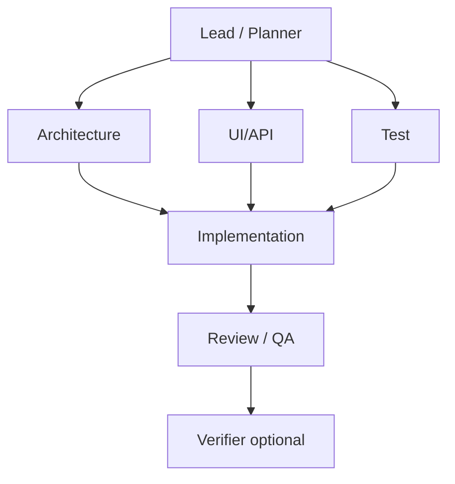

# Complex Task Orchestration

Оркестрация сложных задач в **test-ai** через кастомные subagents в `.cursor/agents/`.

## Workflow (последовательность)

```
Lead → parallel (Architecture + UI/API + Test) → Implementation → Review/QA → [optional Verifier]
```

### Диаграмма

```
                    ┌─────────────────┐
                    │  Lead / Planner │
                    │  /lead-planner  │
                    └────────┬────────┘
                             │
          ┌──────────────────┼──────────────────┐
          │                  │                  │
          ▼                  ▼                  ▼
   /architecture        /ui-api            /test
   Architecture agent   UI/API agent       Test agent
          │                  │                  │
          └──────────────────┴──────────────────┘
                             │
                             ▼
                   /implementation
                  Implementation agent
                  (worktree при параллели)
                             │
                             ▼
                     /review-qa
                Review / QA agent
                             │
                             ▼
                     /verifier (optional)
                финальная сборка + skeptic
```

### Mermaid (альтернатива)



## Агенты workflow

| Команда | Agent file | Роль | Readonly | Когда вызывать |
|---------|------------|------|----------|----------------|
| `/lead-planner` | `lead-planner.md` | Декомпозиция, MVP, назначение агентов, зависимости | yes | Сложная задача, несколько областей, нужен план |
| `/architecture` | `architecture.md` | Техплан, файлы, data flow | yes | После lead или нетривиальная структура |
| `/ui-api` | `ui-api.md` | React/CSS, props, UI edge cases | yes | UI, формы, макеты, контракты компонентов |
| `/test` | `test.md` | Test plan, чеклист, edge cases | yes | Параллельно с architecture/ui-api |
| `/implementation` | `implementation.md` | Код в `src/`, minimal diff | **no** | После планов; worktree для параллели |
| `/review-qa` | `review-qa.md` | Code review, QA checklist, `npm run build` | yes | После implementation, до verifier |
| `/verifier` | `verifier.md` | Финальная проверка сборки | no | После review-qa или когда «готово» |

**Lead / Planner** обязан учитывать skill `scope-guard` и rule `scope-minimal`.

## Когда использовать subagents vs один agent

| Situation | Approach |
|-----------|----------|
| Single coherent UI change | Main agent only |
| Large codebase search | Built-in `explore` (automatic) |
| Long shell/build logs | Built-in `bash` |
| Independent workstreams | `/multitask` или parallel Task + workflow agents |
| Complex multi-area feature | **Lead → parallel planners → Implementation → Review/QA** |
| Verify after "done" | `/review-qa`, then optional `/verifier` |

## Пошаговый workflow

1. **Lead / Planner** (`/lead-planner`) — MVP, шаги, кого вызвать, что параллелить
2. **Respect scope-guard** — propose MVP + iterations before spawning many agents
3. **Parallelize** — Architecture + UI/API + Test (независимые артефакты)
4. **Pass context** in each subagent prompt (no shared chat history)
5. **Implementation** (`/implementation`) — код; для параллельных потоков — git worktree / `best-of-n-runner`
6. **Review / QA** (`/review-qa`) — diff review, QA checklist, `npm run build`
7. **Integrate** — parent merges worktree results if needed
8. **Verify** — optional `/verifier` for final skeptical build check

## Project constraints (test-ai)

- Minimal diff, code in `src/`
- No router/state libs without explicit request
- No test framework unless user asks
- GitLab/Figma MCP: read-only per project rules
- Commits only when user explicitly asks
